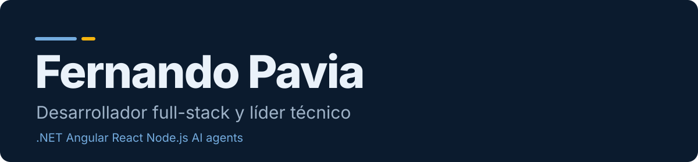

<div align="center">



   [](https://talent.toptal.com/resume/developers/fernando-pavia)

     

[English](README.md) | **Español** | [Português](README.pt.md)

</div>

## La mejor forma de leer mi CV es el sitio

Tiene cinco temas, modo claro y oscuro, y funciona en inglés, español y portugués. Esta página tiene el mismo contenido en texto simple.

<div align="center">

[](https://paviafernando.vercel.app)

</div>

---

## Sobre mí

Soy desarrollador senior, de Argentina. Trabajo sobre todo con .NET, Angular y React, y hoy desarrollo con agentes de IA. Soy desarrollador desde 2007.

Soy miembro de Toptal como ingeniero de IA. Toptal dice que acepta al 3% superior de los postulantes. [Ver mi perfil en Toptal](https://talent.toptal.com/resume/developers/fernando-pavia)

**2007 trabajando como desarrollador | 2017 remoto para clientes del exterior | C2 inglés Cambridge**

### Roles que tuve en proyectos

| Rol | Ejemplo |
| --- | --- |
| **Desarrollador**<br><sub>Desde 2007</sub> | Primero escritorio y web, después .NET, Angular, React y Node.js. Hoy dirijo agentes de IA que escriben buena parte del código. |
| **Administrador de servidores**<br><sub>Janus Automation, GPI</sub> | En Janus Automation administré los servidores web y de bases de datos: actualizaciones, backups y seguridad. En GPI di soporte a los servidores internos y a los entornos de los proyectos. |
| **Administrador de bases de datos**<br><sub>Ternium, J.P. Morgan Chase, GPI</sub> | Escribí y ejecuté scripts SQL correctivos sobre bases en producción, primero para las aplicaciones de Ternium y después en banca. En GPI trabajé en incidentes de performance de base de datos. |
| **Analista**<br><sub>Globant</sub> | Mi puesto en Globant fue developer analyst, en un proyecto para J.P. Morgan Chase. El análisis de requisitos y de negocio es parte de mi trabajo diario. |
| **Gestión de proyectos**<br><sub>GPI, Innovate On Demand</sub> | En GPI trabajé con el gerente técnico en estimaciones, cotizaciones y división de tareas para proyectos web multilingües. Como líder técnico hago estimaciones y planificación de sprints. |
| **Fundador**<br><sub>ComercIApp</sub> | Empecé ComercIApp en 2025. Decido el producto, los flujos y la arquitectura. También hablo directo con los dueños de comercios y los ayudo a cargar su catálogo. |
| **Líder técnico**<br><sub>Innovate On Demand</sub> | Líder técnico desde septiembre de 2025, en varios proyectos de clientes. Me ocupo de la arquitectura, los deploys y las revisiones de código. |

### Cómo trabajo

**Me hago cargo.** Cuando tomo un proyecto, lo trato como propio. En DriveProLink me ocupé de la arquitectura, el deploy y el mantenimiento. En ComercIApp decido el producto, no solo el código.

**Busco que ganemos todos.** Antes de decidir algo, trato de entender qué necesita la otra parte. Con ComercIApp me ofrezco a ayudar a los dueños de comercios a cargar sus primeros productos, para que no tengan que resolverlo solos. En trabajo para clientes, empiezo por las reglas de negocio y después elijo la tecnología.

**La IA trabaja para mí.** Uso agentes de IA todos los días: Claude Code, Cursor y la extensión de Claude en Visual Studio. Yo decido la arquitectura, escribo tareas claras y reviso el resultado. React y TypeScript los escriben sobre todo los agentes, bajo mi dirección. Así puedo llevar yo solo un producto como ComercIApp.

## Proyectos

**[ComercIApp](https://comerci.app)**

Tienda online, pedidos por WhatsApp y facturación en una sola app para comercios chicos de Argentina. Tiene un agente de ventas con IA que atiende a los clientes por WhatsApp. Soy el fundador y me ocupo del producto, la arquitectura y la entrega.

`.NET 8` `React` `PostgreSQL` `AI agent`

**ComercIApp Academy**

Parte de ComercIApp. Más detalles pronto.

`ComercIApp`

**[DriveProLink](https://driveprolink.com)**

Da a las personas la mejor cotización de financiación y leasing de un vehículo, para que lleguen a la concesionaria con un presupuesto y puedan negociar. Trabajé en ella con un equipo en Innovate On Demand, desde la primera versión.

`.NET` `Azure` `React` `Vercel` `PostgreSQL`

**[Translation Portal and GPMS](https://www.translationportal.com)**

El portal de clientes de GPI para cotizaciones, proyectos y reportes, y los sistemas internos que lo sostienen. Trabajé en el rediseño de la interfaz del portal en 2022, en el servidor de traducciones y en GPMS.

`Localization` `CMS connectors` `.NET`

**DealerOMG**

Una plataforma para concesionarias escrita en Node.js. La mantengo en Innovate On Demand.

`Node.js`

**LeaseMax**

Cotizaciones de leasing de vehículos con el motor de API MARSE, y los reportes de LeaseMax.

`Vehicle leasing` `Reports`

**Otros desarrollos.** FlowCraft, un constructor de flujos de trabajo low-code en Next.js. Un plugin de traducción para Optimizely CMS 12 en .NET 8. La reingeniería de un proyecto Yii (PHP) a Node.js. Apps chicas para comercios: punto de venta, delivery, una bicicletería y facturación con ARCA/AFIP.

**Industrias.** Trabajé en banca (J.P. Morgan Chase, a través de Globant), acero (Ternium), energía (AES), automatización industrial, comunicaciones, salud, traducción y localización, financiación automotriz y comercio.

## Experiencia

### Innovate On Demand

**Líder técnico e ingeniero .NET senior** | sep 2025 - Actualidad

*Remoto*

- Trabajé en DriveProLink desde la primera versión, con un equipo. Me ocupé de la arquitectura, el deploy y el mantenimiento.
- Mantengo plataformas para concesionarias escritas en Node.js, como DealerOMG.
- Estabilicé un proceso de deploy frágil y refactoricé de a poco un producto legacy para concesionarias, sin frenar la operación en vivo.
- Estimaciones, planificación de sprints y revisiones de código. Agentes de IA en el desarrollo diario.

### ComercIApp

**Fundador y líder de producto** | 2025 - Actualidad

*Producto propio*

- Tienda online, pedidos por WhatsApp y facturación en una sola app, pensada para dueños sin conocimientos técnicos.
- Un agente de ventas con IA atiende a los clientes por WhatsApp. La app también funciona sin conexión y sincroniza después.
- API web en .NET 8, React y PostgreSQL. Los datos de cada comercio están aislados de los de los demás.
- Decido el producto, los flujos y la arquitectura, y uso agentes de IA para programar más rápido.

### Globalization Partners International

**Desarrollador .NET senior, soluciones de globalización** | dic 2017 - jul 2025

*Contratista, 100% remoto, 7,5 años*

- Trabajé en el Translation Portal, incluido el rediseño de la interfaz de 2022: dashboard, gráficos y controles de seguridad.
- Trabajé en el servidor de traducciones, que recibe los paquetes de contenido a traducir y los pedidos de cotización.
- Trabajé en GPMS, el sistema interno de gestión de proyectos de GPI.
- Desarrollé y mantuve conectores de traducción para CMS: Sitecore XP y XM Cloud, Optimizely, Umbraco, Strapi y Amplience.
- Automaticé flujos de localización entre equipos de traducción, desarrolladores y editores de CMS.
- Resolví incidentes en producción: performance de base de datos, fallas de integración y parches de seguridad.
- Cotizaciones y estimaciones con el gerente técnico. Soporte de servidores internos. Documentación para la certificación ISO.

### Globant, J.P. Morgan Chase

**Developer analyst .NET semi senior** | may 2016 - nov 2017

*Banca, en sitio en un proyecto de J.P. Morgan Chase*

- Aplicaciones web y de escritorio Windows para operaciones bancarias.
- Scripts SQL para procesamiento de datos, reportes y mantenimiento de bases de datos.
- Revisiones de código, pruebas y deploys.

### Janus Automation

**Desarrollador semi senior** | nov 2013 - may 2016

*Automatización industrial. El primer año, desarrollador de soporte en Ternium (acero)*

- Trabajé en un sistema SCADA con monitoreo en tiempo real.
- Publiqué aplicaciones web en producción y administré los servidores web y de bases de datos: actualizaciones, backups y seguridad.
- En Ternium: soporte de sus aplicaciones, con scripts SQL correctivos sobre bases en producción.

### AES Argentina (Infoseek and self-employed)

**Desarrollador** | nov 2009 - jun 2013

*Energía. Primero por cuenta propia, después a través de Infoseek*

- Una aplicación de escritorio con soporte RFID, aplicaciones SharePoint y aplicaciones web.
- Corrección de aplicaciones web y bases de datos en producción.

### Freelance and Eniac Computación

**Desarrollador freelance, y trainee en Eniac** | jun 2007 - nov 2009

*Mis primeros trabajos*

- Sitios web para clientes chicos, con presupuestos y relevamiento de requisitos. Parte fue remoto.
- Soporte en sitio y depuración en Eniac Computación.

## Habilidades

**Lo que uso todos los días.** .NET y C#, ASP.NET Web API y MVC, SQL Server, Angular, JavaScript y TypeScript, HTML y CSS, WordPress, integraciones con CMS, flujos de localización, Azure DevOps y CI/CD, servidores Windows e IIS.

**Lo que usé en producción.** Node.js, React y Next.js, PostgreSQL, MySQL, MongoDB, GraphQL, Docker, Azure, GitHub Actions, APIs de terceros con OAuth2 y webhooks, pagos con Stripe y MercadoPago, BigQuery, eliminación de datos personales según GDPR con registro de auditoría.

**IA.** Uso Claude Code, Cursor y la extensión de Claude en Visual Studio todos los días. Desarrollé con la API de Claude, un agente de ventas con IA dentro de ComercIApp y un modelo local (Ollama) conectado a datos reales de una app.

**Donde soy menos fuerte.** Mi experiencia en AWS (EC2, S3, Lambda) es más limitada que la que tengo en .NET y Azure. No armé un sistema RAG grande en producción. Python es una carencia. Ya no escribo React y TypeScript a mano, lo hacen los agentes bajo mi dirección. Mobile: solo lo básico. No usé Kubernetes.

## Educación e idiomas

- Secundario técnico, Informática. Fray Luis Beltrán, 2006-2008
- Estudios de análisis de sistemas. ISFT N°38, 2008-2010
- Estudios de ingeniería en sistemas. UAI Rosario, 2011-2012
- Curso de AngularJS. Code School, 2016

- Inglés: Cambridge C2 (2015)
- Español: nativo
- Portugués: intermedio

## Contacto

Estoy disponible para trabajo part-time y por contrato con clientes del exterior. Trabajo de forma asíncrona y estoy en UTC-3. Escribime por email o por LinkedIn.

- Email: [paviafernando@gmail.com](mailto:paviafernando@gmail.com)
- LinkedIn: [linkedin.com/in/paviafernando](https://www.linkedin.com/in/paviafernando)
- WhatsApp: [+54 9 336 401-3120](https://wa.me/5493364013120)

---

## Sobre este repositorio

El sitio es una app de React hecha con Vite. No tiene backend. Todo el texto, en tres idiomas, está en `src/content.js`. Los README se generan desde ese mismo archivo.

- Temas: Celeste, Terminal, Editorial, Aurora, Pampa. Cada uno tiene modo claro y oscuro.
- El botón Descargar CV imprime la página con un formato limpio de CV. En la ventana de impresión elegí Guardar como PDF.
- Stack del sitio: React, Vite, CSS. Sin backend ni base de datos.

### Probarlo en local

```bash
npm install
npm run dev
```

### Deploy

Importá el repositorio en Vercel. El preset de Vite funciona sin cambios.
