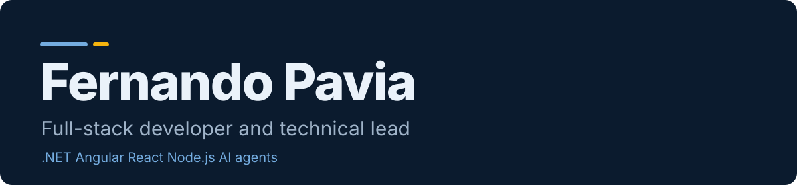

<div align="center">



   [](https://talent.toptal.com/resume/developers/fernando-pavia)

     

**English** | [Español](README.es.md) | [Português](README.pt.md)

</div>

## The best way to read my CV is the site

It has five themes, light and dark mode, and it works in English, Spanish and Portuguese. This page has the same content in plain text.

<div align="center">

[](https://paviafernando.vercel.app)

</div>

---

## About me

I'm a senior developer from Argentina. I work mostly with .NET, Angular and React, and today I build with AI agents. I've been a developer since 2007.

I'm a member of Toptal as an AI engineer. Toptal says it accepts the top 3% of applicants. [See my Toptal profile](https://talent.toptal.com/resume/developers/fernando-pavia)

**2007 working as a developer | 2017 remote for international clients | C2 Cambridge English**

### Roles I've had in projects

| Role | Example |
| --- | --- |
| **Developer**<br><sub>Since 2007</sub> | Desktop and web at first, then .NET, Angular, React and Node.js. Today I direct AI agents that write a good part of the code. |
| **Server admin**<br><sub>Janus Automation, GPI</sub> | At Janus Automation I managed the web and database servers: updates, backups and security. At GPI I supported the internal servers and the project environments. |
| **Database admin**<br><sub>Ternium, J.P. Morgan Chase, GPI</sub> | I've written and run corrective SQL scripts on live databases, first for Ternium's applications and later in banking. At GPI I worked on database performance incidents. |
| **Analyst**<br><sub>Globant</sub> | My title at Globant was developer analyst, on a project for J.P. Morgan Chase. Requirements and business analysis are part of my daily work. |
| **Project manager**<br><sub>GPI, Innovate On Demand</sub> | At GPI I worked with the technical manager on estimates, quotes and task breakdowns for multilingual web projects. As technical lead I do estimation and sprint planning. |
| **Founder**<br><sub>ComercIApp</sub> | I started ComercIApp in 2025. I decide the product, the flows and the architecture. I also talk to shop owners directly and help them load their catalog. |
| **Technical lead**<br><sub>Innovate On Demand</sub> | Technical lead since September 2025, across several client projects. I take care of architecture, deploys and code reviews. |

### How I work

**I take ownership.** When I take a project, I treat it as mine. On DriveProLink I covered architecture, deploy and maintenance. On ComercIApp I decide the product, not only the code.

**I look for a win-win.** Before I decide something, I try to understand what the other side needs. With ComercIApp, I offer to help shop owners load their first products, so they don't have to figure it out alone. In client work, I start with the business rules and then choose the technology.

**AI works for me.** I use AI agents every day: Claude Code, Cursor and the Claude extension in Visual Studio. I decide the architecture, write clear tasks and review the result. React and TypeScript are written mostly by the agents under my direction. That's how I can carry a product like ComercIApp on my own.

## Work

**[ComercIApp](https://comerci.app)**

Online store, WhatsApp orders and invoicing in one app for small shops in Argentina. It has an AI sales agent that answers customers on WhatsApp. I'm the founder and I own product, architecture and delivery.

`.NET 8` `React` `PostgreSQL` `AI agent`

**[ComercIApp Academy](https://academy.comerci.app)**

Tutorials for ComercIApp shop owners: sales, catalog, online store, staff, finances and the AI features. I built it to help them get real value from the app, not just click through it.

`ComercIApp` `Education`

**[DriveProLink](https://driveprolink.com)**

Gives people the best cash finance and lease quote for a vehicle, so they arrive at the dealership with a budget and can negotiate. I worked on it with a team at Innovate On Demand, from the first version.

`.NET` `Azure` `React` `Vercel` `PostgreSQL`

**[Translation Portal and GPMS](https://www.translationportal.com)**

GPI's client portal for quotes, projects and reports, and the internal systems behind it. I worked on the 2022 UI re-design of the portal, on the translation server and on GPMS.

`Localization` `CMS connectors` `.NET`

**DealerOMG**

A dealer platform written in Node.js. I maintain it at Innovate On Demand.

`Node.js`

**LeaseMax**

Vehicle lease quotations with the MARSE API engine, and the LeaseMax reports.

`Vehicle leasing` `Reports`

**More builds.** FlowCraft, a low-code workflow builder in Next.js. A translation plugin for Optimizely CMS 12 in .NET 8. A re-engineering of a Yii (PHP) project to Node.js. Small apps for shops: point of sale, delivery, a bicycle shop, and billing with ARCA/AFIP.

**Industries.** I've worked in banking (J.P. Morgan Chase, through Globant), steel (Ternium), energy (AES), industrial automation, communications, health, translation and localization, automotive finance and retail.

## Experience

### Innovate On Demand

**Technical lead and senior .NET engineer** | Sep 2025 - Present

*Remote*

- Worked on DriveProLink from the first version, with a team. I covered architecture, deploy and maintenance.
- Maintain dealer platforms written in Node.js, like DealerOMG.
- Stabilized a fragile deployment process and refactored a legacy dealer product in small steps, without stopping live operations.
- Estimation, sprint planning and code reviews. AI agents in the daily development.

### ComercIApp

**Founder and product lead** | 2025 - Present

*My own product*

- Online store, WhatsApp orders and invoicing in one app, made for owners without technical knowledge.
- An AI sales agent answers customers on WhatsApp. The app also works offline and syncs later.
- .NET 8 Web API, React and PostgreSQL. The data of each shop is isolated from the others.
- I decide the product, the flows and the architecture, and I use AI coding agents to build faster.

### Globalization Partners International

**.NET senior developer, globalization solutions** | Dec 2017 - Jul 2025

*Contractor, fully remote, 7.5 years*

- Worked on the Translation Portal, including the 2022 UI re-design: dashboard, charts and security checks.
- Worked on the translation server that receives the content packages to translate and the quote requests.
- Worked on GPMS, GPI's internal project management system.
- Built and maintained translation connectors for CMS platforms: Sitecore XP and XM Cloud, Optimizely, Umbraco, Strapi and Amplience.
- Automated localization workflows between translation teams, developers and CMS editors.
- Fixed production incidents: database performance, integration failures and security patches.
- Quotes and estimates with the technical manager. Support for internal servers. Documentation for the ISO certification.

### Globant, J.P. Morgan Chase

**.NET semi senior developer analyst** | May 2016 - Nov 2017

*Banking, on site at a J.P. Morgan Chase project*

- Web and Windows desktop applications for banking operations.
- SQL scripts for data processing, reports and database maintenance.
- Code reviews, testing and deployments.

### Janus Automation

**Semi senior developer** | Nov 2013 - May 2016

*Industrial automation. First year as support developer for Ternium (steel)*

- Worked on a SCADA system with real-time monitoring.
- Deployed web applications to production and managed the web and database servers: updates, backups and security.
- At Ternium: support for their applications, with corrective SQL scripts on live databases.

### AES Argentina (Infoseek and self-employed)

**Developer** | Nov 2009 - Jun 2013

*Energy. Self-employed at first, then through Infoseek*

- A desktop application with RFID support, SharePoint applications and web applications.
- Fixed web applications and databases in production.

### Freelance and Eniac Computación

**Freelance developer, and trainee at Eniac** | Jun 2007 - Nov 2009

*My first jobs*

- Websites for small clients, with budgets and requirements. Some of it was remote.
- On-site support and debugging at Eniac Computación.

## Skills

**What I use every day.** .NET and C#, ASP.NET Web API and MVC, SQL Server, Angular, JavaScript and TypeScript, HTML and CSS, WordPress, CMS integrations, localization workflows, Azure DevOps and CI/CD, Windows and IIS servers.

**What I've used in production.** Node.js, React and Next.js, PostgreSQL, MySQL, MongoDB, GraphQL, Docker, Azure, GitHub Actions, third-party APIs with OAuth2 and webhooks, payments with Stripe and MercadoPago, BigQuery, GDPR data deletion with an audit trail.

**AI.** I use Claude Code, Cursor and the Claude extension in Visual Studio every day. I've built with the Claude API, an AI sales agent inside ComercIApp, and a local model (Ollama) connected to real app data.

**Where I'm less strong.** My AWS experience (EC2, S3, Lambda) is more limited than my .NET and Azure work. I haven't built a large RAG system in production. Python is a gap. I don't write React and TypeScript by hand anymore, the agents do it under my direction. Mobile: basics only. I haven't used Kubernetes.

## Education and languages

- Technical high school, Computer Science. Fray Luis Beltrán, 2006-2008
- Systems analysis studies. ISFT N°38, 2008-2010
- Computer systems engineering studies. UAI Rosario, 2011-2012
- AngularJS course. Code School, 2016

- English: Cambridge C2 (2015)
- Spanish: native
- Portuguese: intermediate

## Contact

I'm open to part-time and contract work with international clients. I work async and I'm based in UTC-3. Write to me by email or LinkedIn.

- Email: [paviafernando@gmail.com](mailto:paviafernando@gmail.com)
- LinkedIn: [linkedin.com/in/paviafernando](https://www.linkedin.com/in/paviafernando)
- WhatsApp: [+54 9 336 401-3120](https://wa.me/5493364013120)

---

## About this repository

The site is a React app made with Vite. It has no backend. All the text, in three languages, is in `src/content.js`. The README files are generated from that same file.

- Themes: Celeste, Terminal, Editorial, Aurora, Pampa. Each one has light and dark mode.
- The Download CV button prints the page with a clean CV layout. Choose Save as PDF in the print window.
- Stack of the site: React, Vite, CSS. No backend, no database.

### Run it locally

```bash
npm install
npm run dev
```

### Deploy

Every push runs the checks and publishes to Vercel from GitHub Actions. `main` goes to production, `develop` to staging, any other branch to a preview URL. Setup is in [docs/DEPLOYMENT.md](docs/DEPLOYMENT.md).
