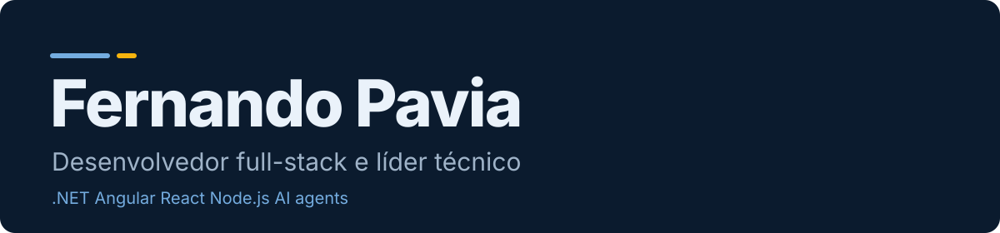

<div align="center">



   [](https://talent.toptal.com/resume/developers/fernando-pavia)

     

[English](README.md) | [Español](README.es.md) | **Português**

</div>

## A melhor forma de ler meu CV é o site

Ele tem cinco temas, modo claro e escuro, e funciona em inglês, espanhol e português. Esta página tem o mesmo conteúdo em texto simples.

<div align="center">

[](https://paviafernando.vercel.app)

</div>

---

## Sobre mim

Sou desenvolvedor sênior, da Argentina. Trabalho principalmente com .NET, Angular e React, e hoje desenvolvo com agentes de IA. Sou desenvolvedor desde 2007.

Sou membro da Toptal como engenheiro de IA. A Toptal diz que aceita os 3% melhores candidatos. [Ver meu perfil na Toptal](https://talent.toptal.com/resume/developers/fernando-pavia)

**2007 trabalhando como desenvolvedor | 2017 remoto para clientes do exterior | C2 inglês Cambridge**

### Papéis que tive em projetos

| Papel | Exemplo |
| --- | --- |
| **Desenvolvedor** | Construo software de desktop e web. Comecei com .NET, depois Angular, React e Node.js. Hoje também dirijo agentes de IA que escrevem boa parte do código. |
| **Administrador de servidores** | Administro servidores web e de banco de dados: atualizações, backups, segurança e os ambientes onde um projeto roda. |
| **Administrador de banco de dados** | Escrevo e executo SQL direto em bancos em produção, e resolvo os problemas de performance e dados que aparecem em um sistema vivo. |
| **Analista** | Transformo necessidades de negócio em requisitos que um time consegue construir, antes de escolher qualquer tecnologia. |
| **Gestão de projetos** | Estimo, divido o trabalho em tarefas e planejo sprints, de uma única feature até um projeto inteiro. |
| **Fundador** | Sou dono de um produto de ponta a ponta: o que é construído, como funciona para quem usa, e a tecnologia por trás. |
| **Líder técnico** | Defino decisões de arquitetura, revejo código e mantenho os deploys sob controle para um time. |

### Como eu trabalho

**Assumo a responsabilidade.** Quando pego um projeto, trato como meu: arquitetura, deploy e manutenção, não só a parte de código que me pediram para escrever.

**Busco que todos ganhem.** Antes de decidir algo, tento entender o que o outro lado realmente precisa. Começo pelas regras de negócio e depois escolho a tecnologia.

**A IA trabalha para mim.** Uso agentes de IA todos os dias: Claude Code, Cursor e a extensão do Claude no Visual Studio. Eu decido a arquitetura, escrevo tarefas claras e reviso o resultado. React e TypeScript são escritos principalmente pelos agentes, sob a minha direção.

## Projetos

**[ComercIApp](https://comerci.app)**

Loja online, pedidos pelo WhatsApp e emissão de notas em um só app para pequenos comércios da Argentina. Tem um agente de vendas com IA que atende os clientes no WhatsApp. Sou o fundador e cuido do produto, da arquitetura e da entrega.

`.NET 8` `React` `PostgreSQL` `AI agent`

**[ComercIApp Academy](https://academy.comerci.app)**

Tutoriais para os donos de comércios que usam o ComercIApp: vendas, catálogo, loja online, equipe, finanças e os recursos de IA. Eu criei para que eles tirem valor real do app, não só para clicar por clicar.

`ComercIApp` `Next.js` `WordPress (headless)`

**Vehicle finance and lease platform**

Produto de um cliente, o nome não é público. Dá às pessoas a melhor cotação de financiamento e leasing de um veículo, para que cheguem à concessionária com um orçamento e possam negociar. Trabalhei nele com uma equipe na Innovate On Demand, desde a primeira versão.

`.NET` `Azure` `React` `PostgreSQL`

**Translation and localization portal**

Produto de um cliente, o nome não é público. Um portal de clientes de uma empresa de localização, para orçamentos, projetos e relatórios, e os sistemas internos por trás dele. Trabalhei no redesenho da interface do portal em 2022, no servidor que recebe os pacotes de tradução e os orçamentos, e no sistema interno de gestão de projetos.

`Localization` `CMS connectors` `.NET`

**Dealer management platform**

Produto de um cliente, o nome não é público. Uma plataforma para concessionárias escrita em Node.js. Eu a mantenho na Innovate On Demand.

`Node.js`

**Vehicle lease quotation engine**

Produto de um cliente, o nome não é público. Um motor de cotações de leasing de veículos, mais os relatórios para o time comercial.

`Vehicle leasing` `Reports`

**Outros projetos.** Um construtor de fluxos de trabalho low-code em Next.js. Um plugin de tradução para o Optimizely CMS 12 em .NET 8. A reengenharia de um projeto Yii (PHP) para Node.js. Apps pequenos para lojas: ponto de venda, delivery, uma loja de bicicletas e faturamento com ARCA/AFIP.

**Setores.** Trabalhei em bancos (J.P. Morgan Chase, por meio da Globant), aço (Ternium), energia (AES), automação industrial, comunicações, saúde, tradução e localização, financiamento automotivo e varejo.

## Experiência

### Innovate On Demand

**Líder técnico e engenheiro .NET sênior** | set 2025 - Atual

*Remoto*

- Trabalhei em uma plataforma de financiamento e leasing de veículos desde a primeira versão, com uma equipe. Cuidei da arquitetura, do deploy e da manutenção.
- Mantenho plataformas para concessionárias escritas em Node.js.
- Estabilizei um processo de deploy frágil e refatorei aos poucos um produto legado para concessionárias, sem parar a operação em produção.
- Estimativas, planejamento de sprints e revisões de código. Agentes de IA no desenvolvimento diário.

### ComercIApp

**Fundador e líder de produto** | 2025 - Atual

*Produto próprio*

- Loja online, pedidos pelo WhatsApp e emissão de notas em um só app, feito para donos sem conhecimento técnico.
- Um agente de vendas com IA atende os clientes no WhatsApp. O app também funciona offline e sincroniza depois.
- API web em .NET 8, React e PostgreSQL. Os dados de cada loja ficam isolados dos das outras.
- Decido o produto, os fluxos e a arquitetura, e uso agentes de IA para programar mais rápido.

### Globalization Partners International

**Desenvolvedor .NET sênior, soluções de globalização** | dez 2017 - jul 2025

*Contratado, 100% remoto, 7,5 anos*

- Trabalhei em um portal de clientes de tradução e localização, incluindo o redesenho da interface em 2022: dashboard, gráficos e verificações de segurança.
- Trabalhei no servidor de traduções, que recebe os pacotes de conteúdo para traduzir e os pedidos de orçamento.
- Trabalhei no sistema interno de gestão de projetos da GPI.
- Desenvolvi e mantive conectores de tradução para CMS: Sitecore XP e XM Cloud, Optimizely, Umbraco, Strapi e Amplience.
- Automatizei fluxos de localização entre equipes de tradução, desenvolvedores e editores de CMS.
- Resolvi incidentes em produção: performance de banco de dados, falhas de integração e patches de segurança.
- Orçamentos e estimativas com o gerente técnico. Suporte aos servidores internos. Documentação para a certificação ISO.

### Globant, J.P. Morgan Chase

**Developer analyst .NET semi sênior** | mai 2016 - nov 2017

*Setor bancário, no cliente, em um projeto do J.P. Morgan Chase*

- Aplicações web e desktop Windows para operações bancárias.
- Scripts SQL para processamento de dados, relatórios e manutenção de banco de dados.
- Revisões de código, testes e deploys.

### Janus Automation

**Desenvolvedor semi sênior** | nov 2013 - mai 2016

*Automação industrial. No primeiro ano, desenvolvedor de suporte na Ternium (aço)*

- Trabalhei em um sistema SCADA com monitoramento em tempo real.
- Publiquei aplicações web em produção e administrei os servidores web e de banco de dados: atualizações, backups e segurança.
- Na Ternium: suporte às aplicações, com scripts SQL corretivos em bancos em produção.

### AES Argentina (Infoseek and self-employed)

**Desenvolvedor** | nov 2009 - jun 2013

*Energia. Primeiro por conta própria, depois pela Infoseek*

- Uma aplicação desktop com suporte a RFID, aplicações SharePoint e aplicações web.
- Correção de aplicações web e bancos de dados em produção.

### Freelance and Eniac Computación

**Desenvolvedor freelance, e trainee na Eniac** | jun 2007 - nov 2009

*Meus primeiros trabalhos*

- Sites para clientes pequenos, com orçamentos e levantamento de requisitos. Parte foi remoto.
- Suporte no local e depuração na Eniac Computación.

## Habilidades

**O que uso todos os dias.** .NET e C#, ASP.NET Web API e MVC, SQL Server, Angular, JavaScript e TypeScript, HTML e CSS, WordPress, integrações com CMS, fluxos de localização, Azure DevOps e CI/CD, servidores Windows e IIS.

**O que já usei em produção.** Node.js, React e Next.js, PostgreSQL, MySQL, MongoDB, GraphQL, Docker, Azure, GitHub Actions, APIs de terceiros com OAuth2 e webhooks, pagamentos com Stripe e MercadoPago, BigQuery, exclusão de dados pessoais conforme a GDPR com trilha de auditoria.

**IA.** Uso Claude Code, Cursor e a extensão do Claude no Visual Studio todos os dias. Desenvolvi com a API do Claude, um agente de vendas com IA dentro do ComercIApp e um modelo local (Ollama) conectado a dados reais de um app.

**Onde sou menos forte.** Minha experiência com AWS (EC2, S3, Lambda) é mais limitada que a que tenho em .NET e Azure, e não montei um sistema RAG grande em produção. Python e Kubernetes ainda são lacunas, e em mobile só tenho o básico.

## Formação e idiomas

- Ensino médio técnico, Informática. Fray Luis Beltrán, 2006-2008
- Estudos de análise de sistemas. ISFT N°38, 2008-2010
- Estudos de engenharia de sistemas. UAI Rosario, 2011-2012
- Curso de AngularJS. Code School, 2016

- Inglês: Cambridge C2 (2015)
- Espanhol: nativo
- Português: intermediário

## Contato

Estou disponível para trabalho part-time e por contrato com clientes do exterior. Trabalho de forma assíncrona e estou em UTC-3. Escreva por e-mail ou LinkedIn.

- Email: [paviafernando@gmail.com](mailto:paviafernando@gmail.com)
- LinkedIn: [linkedin.com/in/paviafernando](https://www.linkedin.com/in/paviafernando)
- WhatsApp: [+54 9 336 401-3120](https://wa.me/5493364013120)

---

## Sobre este repositório

O site é um app React feito com Vite. Não tem backend. Todo o texto, em três idiomas, está em `src/content.js`. Os README são gerados a partir desse mesmo arquivo.

- Temas: Argentina, Matrix, Multinational, Arcade, Patagonia. Cada um tem modo claro e escuro.
- O botão Baixar CV imprime a página com um layout limpo de CV. Na janela de impressão, escolha Salvar como PDF.
- Stack do site: React, Vite, CSS. Sem backend nem banco de dados.

### Rodar localmente

```bash
npm install
npm run dev
```

### Deploy

Cada push roda as verificações e publica na Vercel pelo GitHub Actions. `main` vai para produção, `develop` para staging e qualquer outra branch para uma URL de preview. A configuração está em [docs/DEPLOYMENT.md](docs/DEPLOYMENT.md).
